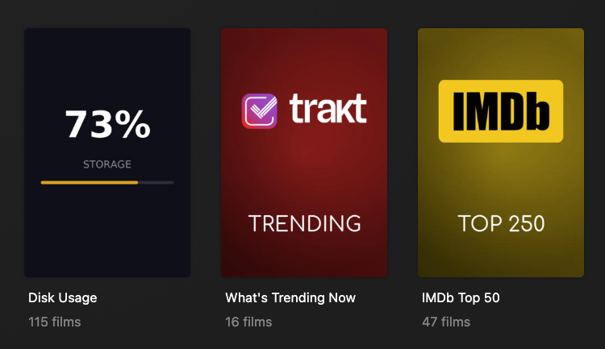

# Plex Disk Usage Collection

Displays live server storage stats as a collection inside Plex using [Kometa](https://kometa.wiki), visible to all users without needing access to any external dashboard.

## What it looks like



In your Plex Movies and TV libraries, a pinned collection called **Disk Usage** appears at the top. Opening the collection shows a breakdown in the description:

```
73% used (10.1 / 14.4 TB) | Movies 3.1 TB (22%) · TV 5.5 TB (38%) · Other 1.4 TB (10%)
Updated: May 15 2026 18:00
```

## How it works

A sidecar container runs alongside Kometa. It runs on a cron schedule defined by `KOMETA_TIME`, updating the collection's cover image and description shortly before each Kometa run. Kometa then runs as normal and pushes the changes to Plex.

## Repository structure

```
kometa-disk-usage/
├── src/
│   └── generate_poster.py   # sidecar script, baked into the container image
├── kometa-config/
│   ├── disk_usage.yml       # Kometa collection definition
│   └── disk_poster.jpg      # generated poster example
├── assets/
│   └── disk_poster.png      # Plex library screenshot
├── Dockerfile
├── entrypoint.sh
└── compose.yaml             # sidecar service, merge into your existing compose file
```

---

## Setup

### Prerequisites

- Docker
- Kometa's config must be a **bind mount** (not a named volume) so the sidecar can share the same directory:
  ```yaml
  volumes:
    - /path/to/kometa/config:/config  # bind mount, not a named volume
  ```
- Your media must be on a single mount point so `df` can report a single usage figure

### 1. Copy the Kometa config files

Copy `disk_usage.yml` from `kometa-config/` into the directory you have bind mounted as `/config` inside your Kometa container.

### 2. Register the collection with Kometa

In your Kometa `config.yml`, add `disk_usage.yml` as a collection file for each library you want it to appear in:

```yaml
libraries:
  Movies:
    collection_files:
      - file: /config/disk_usage.yml
      # ... your other collection files

  TV:
    collection_files:
      - file: /config/disk_usage.yml
      # ... your other collection files
```

### 3. Add the sidecar to your compose file

Clone this repo and add the `disk-stats` service alongside your existing `kometa` service:

```yaml
  disk-stats:
    build: /path/to/plex-disk-usage
    container_name: kometa-sidecar-disk-stats
    environment:
      - TZ=Australia/Sydney                    # your timezone
      - KOMETA_TIME=55 23,5,11,17 * * *        # cron schedule, 5 min before each Kometa run
      - DATA_PATH=/data                        # root mount point for total usage
      - MOVIES_PATH=/data/media/movies         # path to your movies folder
      - TV_PATH=/data/media/tv                 # path to your TV folder
    volumes:
      - /path/to/kometa/config:/config    # same bind mount as your Kometa container
      - /data:/data:ro                    # your media location
    restart: unless-stopped
```

### 4. Start the sidecar

```bash
docker compose up -d disk-stats
```

```bash
docker logs kometa-sidecar-disk-stats
```

```
[2026-05-19T18:28:07] [INFO] Checking disk usage
[2026-05-19T18:28:07] [INFO] Generating poster
[2026-05-19T18:28:07] [INFO] Updating collection YAML
[2026-05-19T18:28:07] [INFO] Done: 71% used (9.7 / 14.4 TB) | Movies 3.3 TB  TV 5.0 TB  Other 1.4 TB
```

### 5. Run Kometa (optional)

If you don't want to wait for Kometa's next scheduled run, you can trigger a manual collections-only run to get the collection into Plex immediately:

```bash
docker exec -it -e KOMETA_RUN=True kometa python3 kometa.py --run --collections-only
```

---

## Configuration

| Environment Variable | Default | Description |
|----------------------|---------|-------------|
| `DATA_PATH` | `/data` | Root mount point. used for total disk usage via `df` |
| `MOVIES_PATH` | `/data/media/movies` | Path to movies folder for size breakdown |
| `TV_PATH` | `/data/media/tv` | Path to TV folder for size breakdown |
| `KOMETA_TIME` | `55 23,5,11,17 * * *` | Cron schedule for when the sidecar runs. Set to 5 min before each Kometa run |
